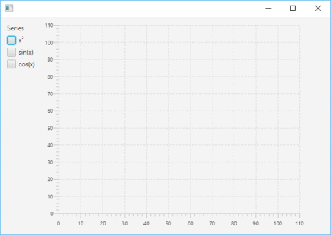

[](https://travis-ci.org/cgiesche/toggleable-series-chart) [](http://search.maven.org/#search%7Cga%7C1%7Cg%3A%22de.perdoctus.fx%22%20AND%20a%3A%22toggleable-series-chart%22) [](https://www.versioneye.com/user/projects/57231f32ba37ce00350af2e1)

**Toggleable Series Chart for JavaFX**

This is a JavaFX control that wraps an XYChart (LineChart, AreaChart etc.) and adds a visibility-toggle checkbox for each series of the chart. It is not very customizable yet. Feel free to contribute if you need more features ;)
This is how it looks like in action:


**Getting started**

FXML
```xml
<ToggleableSeriesChart fx:id="chart" HBox.hgrow="ALWAYS">
    <chart>
        <!-- You can add any type of XYChart here -->
        <AreaChart animated="false">
            <xAxis>
                <NumberAxis side="BOTTOM"/>
            </xAxis>
            <yAxis>
                <NumberAxis side="LEFT"/>
            </yAxis>
        </AreaChart>
    </chart>
</ToggleableSeriesChart>
```

Controller
```java
public class DemoController {

    public ToggleableSeriesChart<Number, Number> chart;

    public void initialize() {
        final XYChart.Series<Number, Number> series1 = new XYChart.Series<>();
        series1.setName("x²");
        final XYChart.Series<Number, Number> series2 = new XYChart.Series<>();
        series2.setName("sin(x)");
        final XYChart.Series<Number, Number> series3 = new XYChart.Series<>();
        series3.setName("cos(x)");

        for (double i = -1 * Math.PI; i <= Math.PI; i = i + 0.01d) {
            series1.getData().add(new XYChart.Data<>(i, (i * i) - 1));
            series2.getData().add(new XYChart.Data<>(i, Math.sin(i)));
            series3.getData().add(new XYChart.Data<>(i, Math.cos(i)));
        }

        chart.getData().addAll(series1, series2, series3);
    }

}
```